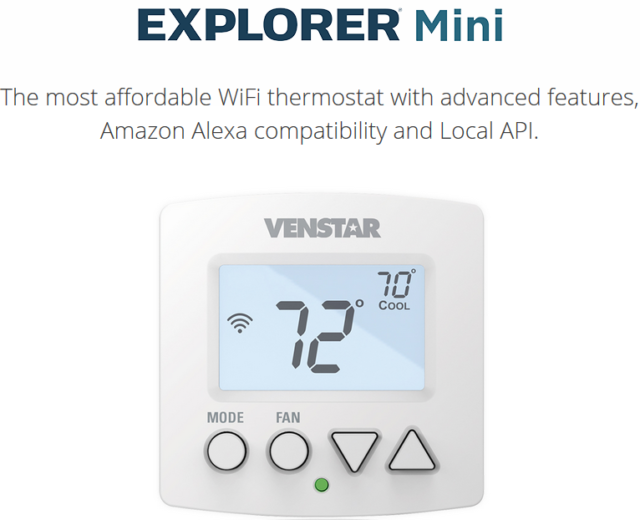

# homebridge-venstar-explorer-mini

Support for the Venstar Explorer Mini (T2000) Thermostat on HomeBridge Platform

# Installation

1. Ensure the API is enabled on your Thermostat, consult the manual for instructions
2. Install this plugin using: npm install -g homebridge-venstar-explorer-mini

# Configuration

There is no configuration necessary, the plugin will automatically find your thermostat using SSDP (Simple Service Discovery Protocol). Thermostat and Homebridge must be running on the same subnet